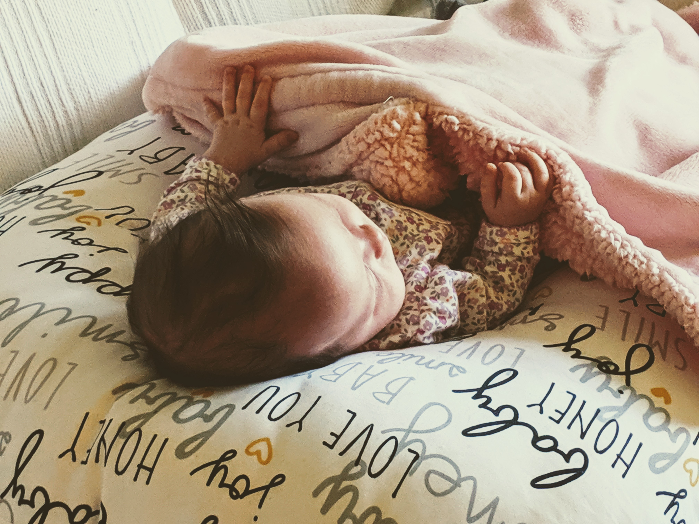

Holy smokes, is daycare expensive. I just enrolled our little one into daycard for the fall and it's close to **$65.00** per day to take care of my little one.

Now, don't get me wrong..I work just parttime and spend a lot of time with my child so I'm aware of how much work it is to take care of a kiddo and mine is still a baby that sleeps through the day!

But, she has a spot for 2 days a week when I can go to work and get a little time away from the kiddo. Fiscally, it doens't make a whole lof of sense but it allows her to interact with others her own age and gives me some time away from fatherly duties.

This doesn't happen until the fall so we have some time to change our plan of attack but so far she's going to start daycare in August.