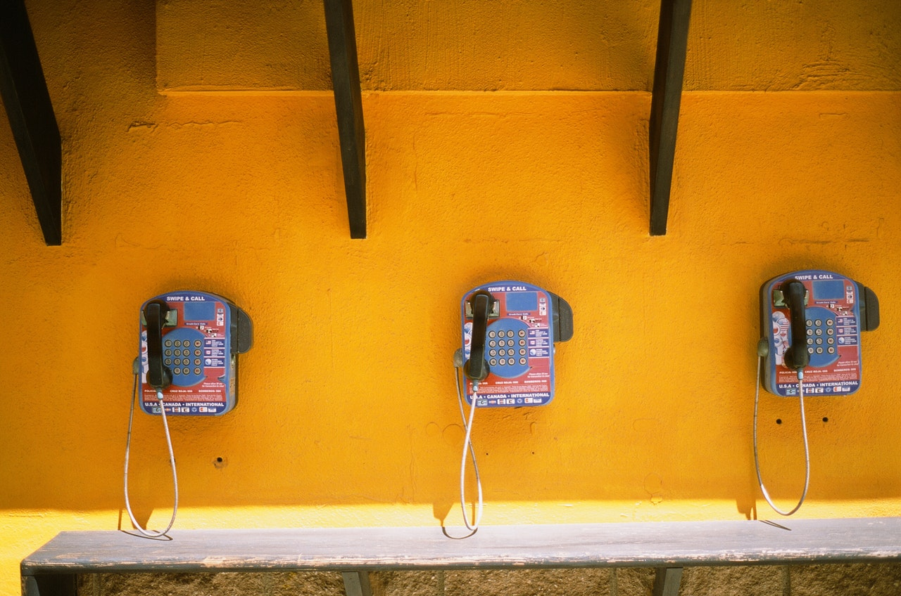

It started out like a normal day. I was off and in [front of a printer trying to get it to work ]([https://jim.am/printer-hell/](https://jim.am/printer-hell/) when my phone rang:

SPAM - said Google's call display - so I ignored it.

And then **they. just.kept coming**. I must have had about 30 robocalls today. I don't know what I've done to piss somebody off but somewhere, somehow my phone number is robocall heaven for the robocallers.

I must have had 30+ robocalls today. I tweaked the settings on my [carrier](https://jim.am/switching-from-verizon-to-google-fi/) to have them block more of them and then I found and tried a few robocall blocker apps and [this one seems pretty good](https://play.google.com/store/apps/details?id=com.vladlee.callblocker).

It's only been a few hours since I installed this app but it seems to be working so far. I have it set up to only allow my contacts to call me and to ignore everybody else which is what I do manually anyway.

I would usually get one robocall a day at most but this is now **out of control** and needs to be fixed somehow.

One would think that if Google can order you a pizza and build a self driving car then it should be a weekend project to get some robocall blocking app made that actually works.

In the meantime, I will just wince every time my phone rings.
